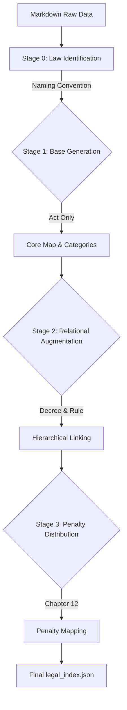
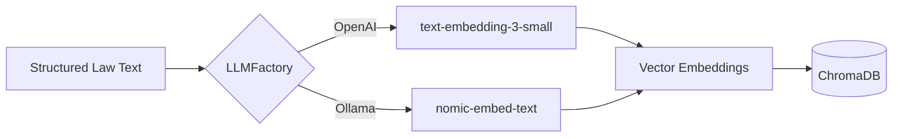
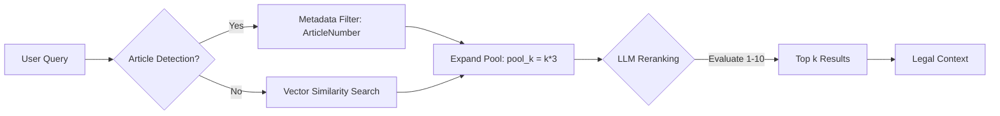
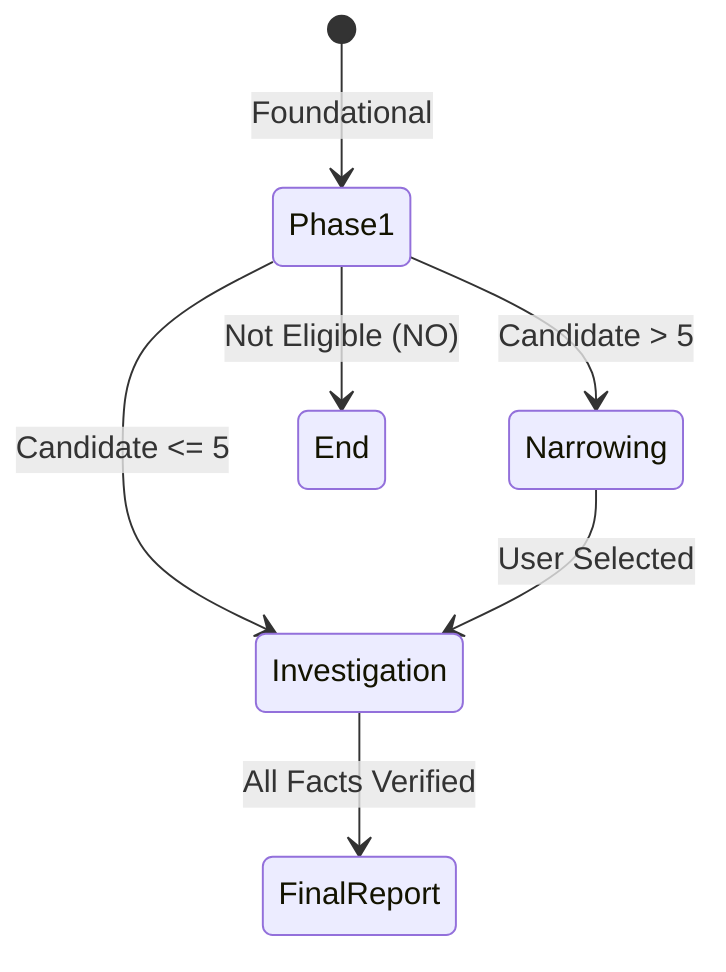
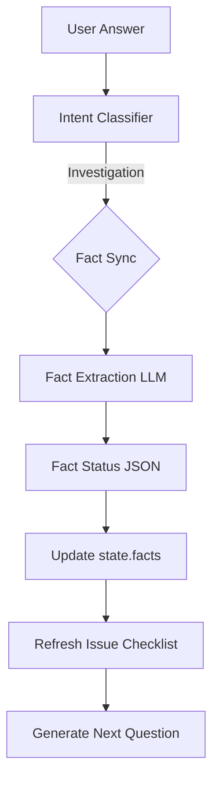
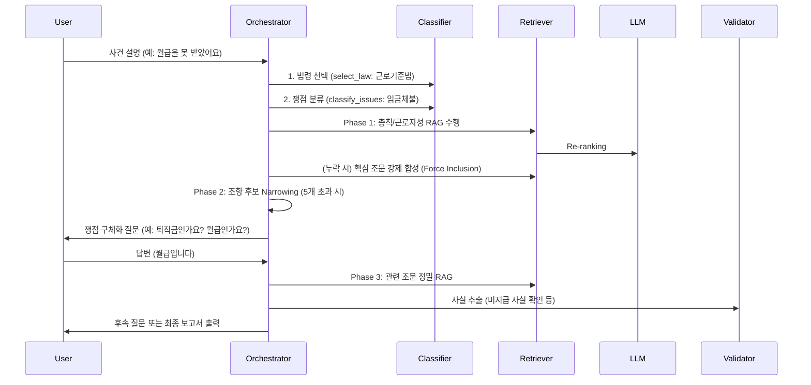
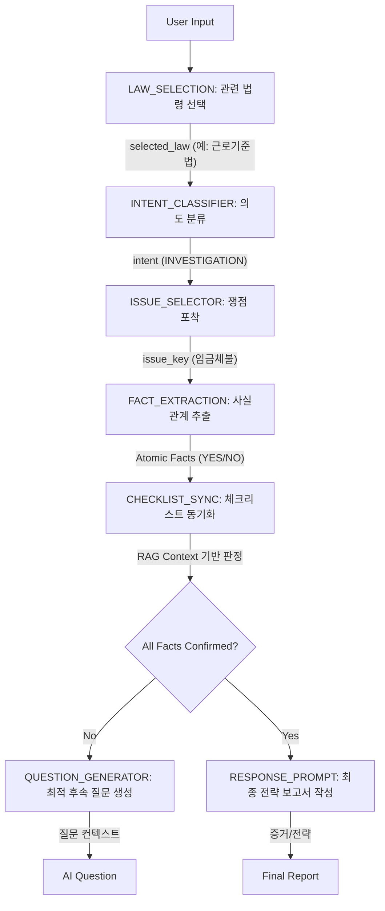

# LawProject Ultra-Detailed Technical Specification

본 문서는 LawProject의 전반적인 기술 아키텍처와 세부 구현 로직을 코드 수준에서 분석하여 정리한 초정밀 기술 명세서입니다.

---

## 1. 지식 구축 레이어 (Data Ingestion & Indexing)

시스템의 지식 베이스는 '어떤 법령'의 '어떤 조문'인지를 정확히 구분하는 것에서 시작합니다.

### 1.0. 법령 구분 및 네이밍 규칙 (Law Identification)
`LegalIndexer`는 데이터 디렉토리 내의 파일명을 분석하여 법령의 종류와 위계를 구분합니다.

- **파일 네이밍 컨벤션**: `[법령명](위계).md` 형식을 사용합니다.
    - 예: `근로기준법(법률).md`, `남녀고용평등법(법률).md`, `근로기준법(시행령).md`
- **구분 로직**: `target_law_name` 변수를 통해 특정 법령 파일만 선별적으로 로드합니다.

```python
# 법령 및 위계 구분 핵심 코드 (indexer.py)
for filename in os.listdir(self.data_path):
    # 파일명에 '근로기준법'과 '(법률)'이 모두 포함된 파일만 선택
    if filename.endswith(".md") and self.target_law_name in filename and f"({target_ltype})" in filename:
        # 해당 법령의 텍스트만 추출하여 처리
        pass
```

### 1.1. 2단계 무손실 인덱싱 파이프라인
`app/indexer.py`의 `run()` 메서드는 다음과 같은 단계를 통해 법령을 정형화합니다.



1.  **Stage 1: Base Generation (법률)**
    - `_stage1_base_generation()`: 법률(Act) 마크다운을 분석하여 대분류(Categories)를 자동 생성합니다. 
    - `start_num`, `end_num` 범위를 추출하여 해당 범위 내의 모든 조항을 `core_articles`로 선행 매핑합니다.
2.  **Stage 2: Relational Augmentation (시행령/시행규칙)**
    - `_stage2_augmentation()`: 하위 법령(Decree, Rule) 텍스트 내의 **상호 참조(Regex: `제(\d+)조`)** 패턴을 감지합니다.
    - "법 제43조를 위반한..."과 같은 문구를 찾아 시행령 조항을 해당 법률 조항의 `sub_articles` 리스트에 계층적으로 연결합니다. (1:N 관계 복원)

    ```python
    # Relational Augmentation 핵심 로직 예시
    def _stage2_augmentation(self, base_index, target_type):
        # ... 상호 참조 정규표현식 감지
        ref_match = re.search(r"제?\s*(\d+)\s*조", content)
        if ref_match:
            ref_article_num = ref_match.group(1)
            # base_index에서 부모 조항을 찾아 자식으로 추가
            if ref_article_num in base_index:
                base_index[ref_article_num]['sub_articles'].append(current_article)
    ```

3.  **Stage 3: Penalty Distribution (벌칙 배분)**
    - `_distribute_penalties()`: 법령의 '벌칙' 장에 모여 있는 처벌 규정들을 각 실무 조항(예: 임금 지급 조목)으로 재배치하여, 상담 시 처벌 수위까지 함께 안내될 수 있도록 합니다.

### 1.2. 임베딩 및 벡터 저장 (Embedding & Vector Storage)
가공된 법령 데이터는 `LLMFactory`를 통해 고차원 벡터로 변환되어 `ChromaDB`에 영구 저장됩니다.



- **멀티 모델 인터페이스**: `LLMFactory.create_embeddings()`는 환경 변수(`LLM_TYPE`)에 따라 클라우드(OpenAI) 또는 로컬(Ollama) 모델을 유연하게 스위칭합니다.
- **컨텍스트 보존 분할**: `MarkdownHeaderTextSplitter`를 사용하여 `#`~`####` 헤더 단위로 조문을 분할하며, 각 벡터에는 `Chapter`, `Section`, `Article` 등의 메타데이터를 함께 저장하여 검색 시 맥락 손실을 최소화합니다.

```python
# 임베딩 생성 인터페이스 (llm_factory.py)
def create_embeddings(model_type="openai", model_name=None):
    if model_type == "openai":
        return OpenAIEmbeddings(openai_api_key=os.getenv("OPENAI_API_KEY"))
    elif model_type == "ollama":
        return OllamaEmbeddings(model="nomic-embed-text", ...)
```

### 1.3. 통합 지식 인덱스 구조 (Unified Index Structure)
여러 법령이 존재할 경우, `legal_index.json`은 최상위 키로 **법령명**을 사용하여 데이터 영역을 격리합니다. 이 인덱스는 벡터 검색 후보군을 좁히는 **메타데이터 필터링의 기준**이 됩니다.

```json
{
  "version": "2.0",
  "laws": {
    "근로기준법": { "categories": [...], "core_articles": {...} },
    "남녀고용평등법": { "categories": [...], "core_articles": {...} }
  }
}
```

---

## 2. 하이브리드 RAG 엔진 (Search Strategy)

`rag/retriever.py`는 정확한 조문 검색을 위해 3단계 검색 전략을 수행합니다.

### 2.1. 다단계 검색 루프


1.  **조문 번호 감지 (Article Detection)**: 쿼리에서 "제43조"와 같은 키워드를 정규표현식으로 추출하여 ChromaDB의 메타데이터 필터(`ArticleNumber`)를 우선 가동합니다.
    ```python
    # 조문 번호 자동 추출 (Retriever.py)
    article_match = re.search(r"제?\s*(\d+)\s*조", query)
    if article_match:
        search_filter = {"ArticleNumber": article_match.group(1)}
        results = vs.similarity_search(query, k=pool_k, filter=search_filter)
    ```
2.  **Pool 확장 (Candidate Pool)**: 최종 결과값 `k`의 3배수인 `pool_k`만큼의 후보군을 먼저 수집합니다.
3.  **LLM Re-ranking**: `RERANK_PROMPT`를 통해 LLM이 후보군 조문들의 법적 연관성(1~10점)을 재평가하여 가장 직접적인 조문만 최종 결과로 반환합니다.

### 2.2. 강제 포함 로직 (Mandatory Force Inclusion: RAG의 안전망)
`orchestrator.py`의 `_get_law_context` 메서드는 인덱스에 정의된 **핵심 조항(`core_articles`)**이 벡터 검색에서 누락될 경우를 대비한 안전 장치를 포함합니다.

- **목적**: 시맨틱 검색(유사도 기반)의 불완전성을 보완하여, 특정 상담 단계에서 반드시 검토해야 하는 법적 정의(예: 근로자성, 임금의 정의 등)가 누락되는 것을 방지합니다.
- **작동 원리**: `legal_index.json`에 명시된 해당 카테고리의 핵심 조문 번호를 체크하여, 검색 결과에 포함되어 있지 않다면 조문 번호로 직접 조회하여 결과를 강제로 선별된 컨텐츠에 합칩니다.

```python
# 핵심 조항 강제 누락 방지 로직 (Orchestrator.py)
# 벡터 검색이 놓친 근거 조항을 명시적으로 수집하여 법적 정확도 100% 보장
if core_articles:
    for art_num in core_articles:
        if art_num not in retrieved_article_nums:
            force_doc = self.retriever.retrieve_by_number(art_num)
            results.append(force_doc)
```

---

## 3. 오케스트레이션 로직 (3-Phase Flow)

`app/orchestrator.py`의 `process_input()`은 사용자의 발언을 분석하여 상담 단계를 동적으로 제어합니다.

### Phase 1: Foundational Eligibility (기초 성립 요건)
- **핵심 로직**: `use_foundational=True` 옵션으로 법률의 '총칙(General Provisions)' 영역을 집중 검색합니다.
- **판단 기준**: 사용자가 근로자인지, 사업장 규모가 법 적용 대상인지를 판단하는 `existence` 타입 체크리스트를 생성합니다. (하나라도 `NO`일 경우 상담 조기 중단 로직 가동)



### Phase 2: Category Narrowing (쟁점 압축)
- **임계값 제어**: 후보 조항이 **5개 이상**일 경우 `_check_if_narrowing_needed`가 발동합니다.
- **동적 옵션 생성**: LLM이 조항 제목들을 분석하여 사용자가 선택할 수 있는 3~4개의 카테고리 옵션을 생성(`_generate_narrowing_question`)하고, 사용자의 선택에 따라 조항군을 대폭 압축합니다.

    ```python
    # Phase 전환 및 분기 로직 (Orchestrator.py)
    def process_input(self, user_input, state):
        intent, skip_classifier = self._classify_intent(user_input, state)
        # ...
        if state.investigation_phase == "CORE":
            # Foundational 검증 완료 시 DEEP(쟁점 조사)으로 전이
            state.investigation_phase = "DEEP"
            return self._perform_investigation(user_input, state)
    ```

### Phase 3: Factual Investigation (정밀 사실 조사)
- **체크리스트 동기화**: `_sync_checklist()`를 통해 RAG로 추출된 상세 조문 요건을 실시간 체크리스트로 변환합니다.
- **사실 관계 추출**: `FactValidator.extract_facts()`는 사용자 답변에서 `YES/NO/UNKNOWN` 상태를 JSON으로 추출하여 `state.facts`를 실시간 업데이트합니다.

    ```python
    # 사실 관계 추출 로직 (FactValidator.py)
    def extract_facts(self, user_input, required_facts):
        # LLM을 통해 비정형 텍스트에서 JSON 상태 추출
        response = self.chain.invoke({"user_input": user_input, "required_facts": required_facts})
        data = json.loads(self._clean_json_output(response.content))
        return {f: FactState(v) for f, v in data.items() if v in FactState.__members__}
    ```



---

## 4. 상태 및 사실 관리 (State & Fact Logic)

- **ConversationState (`app/state.py`)**: 
    - 모든 사실은 `FactState` 열거형으로 관리됩니다.
    - `update_fact()` 메서드는 새로운 사실이 발견될 때마다 상태를 원자적(Atomic)으로 업데이트하며, 이 상태는 `Composer`가 최종 보고서를 작성하는 근거가 됩니다.
- **RAG-Only Policy**: 
    - `llm/prompts.py`에 정의된 모든 프롬프트는 "제공된 법령 텍스트 외의 지식을 사용하지 마라"는 제약 조건이 걸려 있어, LLM의 환각(Hallucination) 현상을 차단합니다.

---

## 5. 전체 시스템 인터랙션 시퀀스 (Interaction Sequence)

시스템은 사용자의 첫 입력 시점에 **가장 먼저 어떤 법령에 해당하는지**를 판단하여 상담의 방향성을 결정합니다.



### 5.1. 실시간 법령 식별 (Runtime Law Selection)
`orchestrator.py`가 상담을 시작할 때(`state.current_step == "START"`), 사용자의 첫 메시지를 분석하여 `selected_law`를 결정합니다.

- **로직**: `LAW_SELECTION_PROMPT`를 통해 사용자의 발화 의도가 가용한 법령(`legal_index.json` 내의 `laws` 키값들) 중 어디에 가장 부합하는지 LLM이 판단합니다.
- **연쇄 작용**: 선택된 `selected_law` 값은 이후 `IssueClassifier`가 해당 법령의 카테고리만 불러오고, `LawRetriever`가 해당 법령의 조문만 검색하도록 하는 **컨텍스트 필터** 역할을 수행합니다.

---

## 6. LLM 프롬프트 아키텍처 (Prompt Workflow)

LawProject의 모든 지능형 판단은 `llm/prompts.py`에 정의된 프롬프트 체인을 통해 유기적으로 연결됩니다.

### 6.1. 프롬프트 기반 사고 체인 (Chain of Thought Flow)

단순한 API 호출이 아닌, LLM이 법률 상담가로서 사고하는 논리적 전이 과정을 시각화한 흐름도입니다.



#### [사고 단계별 기술적 디테일]
1.  **법령 필터링 (Selection)**: 입력값에서 '퇴직금', '해고', '연차' 등의 키워드를 분석하여 `legal_index.json`에서 탐색할 루트(Root) 법령을 격리합니다.
2.  **의도 및 쟁점 포착 (Classify)**: 단순히 단어를 찾는 것이 아니라, 사용자가 '상황을 설명'하는지 '질문을 하는지'를 구분하고, 다중 쟁점(예: 해고+임금체불)을 배열 형태로 동시에 포착합니다.
3.  **비정형의 정형화 (Extraction)**: "아직 돈 못 받았어요"라는 문장을 "지급여부: NO"라는 기계 학습 가능한 데이터로 치환하는 **데이터 노멀라이징** 단계입니다.
4.  **법령 근거 동기화 (Sync)**: **RAG-Only Policy**가 가장 강력하게 적용되는 지점으로, LLM이 가진 외부 지식을 배제하고 오직 검색된 조문의 문구만으로 체크리스트의 각 항목을 '판정'합니다.

### 6.2. 주요 프롬프트 역할 및 데이터 흐름 (Data Flow Deep-Dive)

| 프롬프트 명칭 | 주요 입력 (Inputs) | 주요 출력 (Outputs) | 내부 추론 로직 및 제약 조건 |
| :--- | :--- | :--- | :--- |
| **Selection** | User Query, 가용 법령 목록 | `selected_law`, `confidence` | **[최우선순위]** 하이브리드 인덱싱 결과와 매칭되지 않을 시 '기타법률'로 분류하여 환각 방지 |
| **Classification** | Input, 법령별 카테고리 | `intent`, `issues` | **[상태 인지]** 상담 단계(START/DEEP)를 참조하여, 답변이 짧더라도 맥락상 사실 정보이면 INVESTIGATION으로 분류 |
| **Extraction** | Answer, Required Facts | `JSON: {fact: status}` | **[원자성]** 복합 질문에 대한 답변에서 각 사실을 개별 엔터티로 추출. "UNKNOWN"은 정보 부족 시 즉시 할당 |
| **Sync** | RAG Context, Facts, History | `JSON: checklist` | **[의미론적 매핑]** `Requirement`를 고유 ID로 취급하여, 표현이 조금 달라도 이미 확인된 사실은 기존 ID에 유지 |
| **Generator** | Issue Checklist, Phase | `question`, `type` | **[전략적 질문]** Phase 1(추상적/포괄적) vs Phase 3(구체적/수치적) 페르소나를 스위칭하며 최소 질문 설계 |
| **Composer** | Facts, Laws, Checklist | `Strategy Report` | **[논리적 인과]** 확인된 사실(Fact)을 법적 요건(Law)에 대입하여 위반 가능성을 도출하고 입증 증거를 가이드 |

### 6.3. 전수 프롬프트 라이브러리 (Comprehensive Prompt Catalog)

주요 로직 외에 시스템의 정밀도와 유연성을 책임지는 보조 프롬프트들의 명세입니다.

#### ① 검색 고도화 프롬프트
- **`RERANK_PROMPT` (`retriever.py`)**: 벡터 검색 결과(`pool_k`) 중 질문과 법적으로 가장 밀접한 조문만 점수제(1~10점)로 선별합니다.
- **`NARROWING_MATCH_PROMPT` (`prompts.py`)**: 사용자의 답변이 메뉴 번호가 아닌 서술형일 때, 이를 LLM이 분석하여 가장 적절한 조항 카테고리(Option Label)로 매핑합니다.

#### ② 상담 흐름 제어 프롬프트
- **`CATEGORY_NARROWING_PROMPT` (`chain.py`)**: 후보 조항이 너무 많을 때, 이를 그룹화하여 사용자에게 선택지를 제시하는 질문과 옵션을 동적으로 생성합니다.
- **`DIRECT_LEGAL_ANSWER_PROMPT` (`prompts.py`)**: 법적 사실 판정이 아닌, 단순한 용어나 제도에 대한 정보성 질문(`INFO_QUERY`)에 답변합니다.
- **`WITTY_GUIDANCE_PROMPT` (`prompts.py`)**: 사용자의 일상적인 대화(`CHITCHAT`)에 재치 있게 응답하면서 다시 법률 상담으로 복귀하도록 유도합니다.

#### ③ 상태 요약 및 출력 프롬프트
- **`INTERIM_SUMMARY_PROMPT` (`prompts.py`)**: 현재까지 확인된 사실관계와 누락된 항목을 표(Table)와 아이콘(✓, ✕, ○)을 활용해 중간 점검 보고서 형태로 출력합니다.
- **`SYSTEM_PROMPT` (`prompts.py`)**: AI의 전반적인 페르소나와 "짧고 명쾌한 전문적 상담"이라는 핵심 응대 원칙을 정의합니다.

### 6.4. 초정밀 프롬프트 엔지니어링 전략 (Prompt Engineering Deep-Dive)

단순한 지시를 넘어, 법률 상담의 정확도를 극대화하기 위해 다음과 같은 고도화된 프롬프트 기법을 적용하고 있습니다.

#### ① 원자적 분해 전략 (Atomic Decomposition)
- **적용**: `CHECKLIST_SYNC`, `FACT_EXTRACTION`
- **로직**: 법령의 한 조문에 포함된 여러 요건(예: 상시 5인 이상 + 근로기간 1년 이상)을 하나의 문장으로 묻지 않고, 각각 별도의 데이터 행(Row)으로 분해합니다.
- **이점**: 사용자의 답변이 어떤 부분 조건에 해당하는지 LLM이 100% 명확하게 매핑할 수 있어, 복합적인 법률 요건 판단의 누락을 방지합니다.

#### ② 화자 분리 및 페르소나 보정 (Subjectivity Separation)
- **적용**: `QUESTION_GENERATOR`, `FACT_EXTRACTION`
- **로직**: 한국어 법령에서 "사용자(Employer)"는 회사를 의미하지만, 채팅 시스템에서는 "현재 대화 중인 유저(User)"와 혼동될 수 있습니다. 이를 방지하기 위해 프롬프트 내에 **"사용자(Employer)는 회사를 의미하며, 대화 상대(User)와 엄격히 분리하라"**는 명시적 제약 조건을 삽입했습니다.
- **이점**: AI가 "사용자가 누구인가요?"라고 묻는 대신 "회사의 대표자는 누구인가요?" 또는 "고용주는 누구인가요?"와 같이 명확한 명칭을 사용하도록 유도합니다.

#### ③ 부정 제약 조건 및 안전장치 (Negative Constraints)
- **적용**: 전 프롬프트 공통
- **핵심 제약**: 
    1. **PII(개인정보) 수집 금지**: 실명, 주소, 연락처 등을 묻지 않도록 강제.
    2. **전문 용어 풀이 금지**: "제N조에 따르면~"과 같은 법률적 전언을 생략하고, 오직 "사실관계"만을 묻도록 설계.
    3. **예시(e.g.) 제시 금지**: 사용자가 예시에 맞춰 답변을 끼워 맞추는 '유도 신문' 효과를 방지하기 위해 예시 삽입을 엄격히 제한.

#### ④ 상태 지속성 보장 (State Continuity)
- **적용**: `CHECKLIST_SYNC`
- **로직**: `requirement` 문자열을 고유 ID로 취급합니다. LLM이 매 턴마다 새로운 체크리스트를 생성하더라도, 기존에 확인된 사실관계의 고유 ID가 유지되도록 **"Semantic Synonym Mapping(의미적 유사어 매핑)"** 지침을 통해 상태 전이의 연속성을 보장합니다.

---
